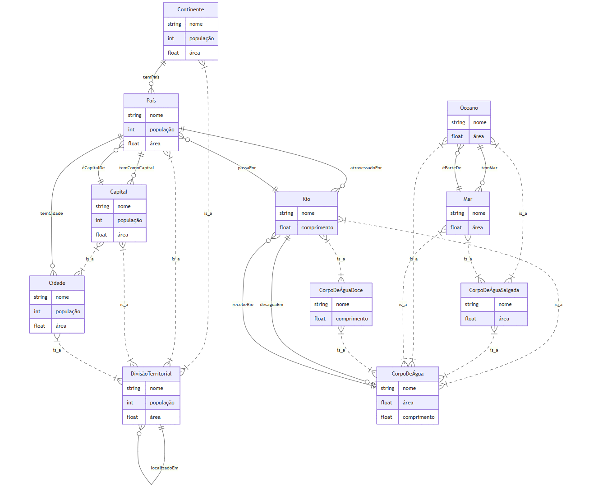

# Projeto RPCW

## Introdução

Este relatório apresenta o desenvolvimento de uma ontologia com o tema "Geografia" e de uma aplicação interativa que permite a sua exploração. A aplicação aceita ontologias genéricas, possibilita a navegação pelo seu conteúdo e a criação de quizzes com perguntas aleatórias baseadas nesses dados. Funciona ainda como servidor para a aplicação dos quizzes, permitindo que os utilizadores se juntem a sessões em tempo real, respondam às questões e comparem os resultados obtidos com os dos restantes utilizadores.

## Ontologia geografia

### Classes

- CorpoDeÁgua
  - CorpoDeÁguaDoce
    - Rio
  - CorpoDeÁguaSalgada
    - Mar
    - Oceano
- DivisãoTerritorial
  - Cidade
    - Capital
  - Continente
  - País

### Atributos (Data Properties)

- nome: designação do elemento, qualquer elemento de qualquer classe deve ter este atributo

- população: atributo característico das diferentes divisões territoriais que mostra o número de habitantes

- área: atributo utilizado para demonstrar o tamanho das divisões territoriais e dos corpos de água salgada

- comprimento: atributo relativo aos rios que mede o seu tamanho

### Relacionamentos

##### Localização territorial

- localizadoEm (DivisãoTerritorial -> DivisãoTerritorial)
- temPaís (Continente -> País)
- temCidade (País -> Cidade)

##### Identificação da capital dos países

- éCapitalDe (Capital -> País)
- temComoCapital (País -> Capital)

##### Localização dos mares e oceanos

- temMar (Oceano -> Mar)
- éParteDe (Mar -> Oceano)

##### Fronteiras

- fazFronteiraCom (CorpoDeÁguaSalgada ou País -> CorpoDeÁguaSalgada ou País)

##### Localização dos rios

- passaPor (Rio -> País)
- atravessadoPor (País -> Rio)

- desaguaEm (Rio -> CorpoDeÁgua)
- recebeRio (CorpoDeÁgua -> Rio)

### Representação

### Indivíduos

A recolha de indivíduos foi realizada através do script de [povoamento](./our_ontology/povoamento.py) que funciona da seguinte forma:

+ Leitura de uma [ontologia base](./our_ontology/geo_base.ttl) criada a partir do [protégé](https://protege.stanford.edu/), através da biblioteca [rdflib](https://pypi.org/project/rdflib/4.0/).

+ Realização de queries à [WikiData](https://query.wikidata.org/#) para obtenção dos dados.

+ Adição dos triplos necessários à ontologia, tendo em conta os dados recolhidos.

+ Escrita da ontologia obtida no ficheiro [geografia.ttl](./our_ontology/geografia.ttl).

Adicionalmente, foi criada uma versão mais simplificada da ontologia, a [geografia_quiz.ttl](./our_ontology/geografia_quiz.ttl), com menos informações sobre os atributos (área, população e comprimento dos rios) e sobre a localização dos mares relativamente aos oceanos, tornando esta ontologia mais indicada para a formulação de questões para o quiz.

## Aplicação de geração de Quizzes

A aplicação permite carregar ontologias, explorar os seus conteúdos, gerar quizzes automáticos e realizar jogos em tempo real onde vários utilizadores respondem às perguntas e comparam os seus resultados.

O jogo permite que os jogadores compitam entre si de forma dinâmica e envolvente, promovendo simultaneamente o desenvolvimento do seu conhecimento geral.

### Página Inicial
Tal como é comum em jogos deste tipo, existe uma página inicial onde o jogador pode optar por uma das seguintes opções:

- Juntar-se a uma partida existente (introduzindo um código e um nome de utilizador criado no momento)

- Criar uma nova partida.

### Questões

As perguntas são identificadas por um número, um enunciado e um corpo, que varia consoante o tipo de questão.

- No caso de perguntas de **verdadeiro/falso**, surgem duas opções: "Verdadeiro" ou "Falso".
- Nas questões de **escolha múltipla**, são apresentadas várias opções de resposta.
- Por fim, nas perguntas de **associação**, surgem duas colunas, sendo necessário relacionar corretamente os elementos entre si.

Em todos os casos, existe sempre uma única resposta válida.

#### Questões Automáticas

De forma sintática, é possível criar questões aleatórias sobre uma determinada ontologia previamente carregada. As questões derivam de queries que extraem conhecimento selecionando aleatoriamente entidades relacionadas, um relacionamento entre elas e atributos das entidades selcionadas. Esta informação é posteriormente utilizada para preencher as prompts da LLM, que devolve uma questão estruturada no formato pretendido.

### Criar uma Partida

O criador da partida tem controlo total sobre o tema e o número de perguntas a incluir. Pode escolher entre temas **pré-definidos**, e pedir que seja gerado automaticamente um conjunto de questões, com possibilidade de reorganização ou exclusão.
Em alternativa, pode fornecer uma **ontologia própria** para gerar perguntas de forma aleatória, ou **criar manualmente** cada questão, indicando o tipo, as opções de resposta e a solução correta.

Após concluir a seleção ou criação das perguntas, o criador seleciona a opção de começar a partida e é redirecionado para uma **página de espera**. Nesta página é apresentado um **código numérico**, que deve ser partilhado com os restantes jogadores. À medida que os participantes se juntam à partida, os seus nomes de utilizador são exibidos, assim como o total de jogadores. Quando o número for considerado adequado, o criador pode iniciar o jogo.

### Dinâmica do Jogo

Todos os participantes são encaminhados para a mesma interface de jogo, embora com funções ligeiramente distintas.

O **criador da partida** visualiza a questão já resolvida. Após 30 segundos — ou quando todos os jogadores tiverem submetido as suas respostas — poderá avançar para a questão seguinte.

Os restantes **jogadores** visualizam a questão por resolver, com indicação do número de participantes ainda a responder e um temporizador de 30 segundos. Após submeterem a sua resposta, têm acesso à versão resolvida da questão, onde podem verificar se acertaram ou não. Cada resposta correta vale **1 ponto**.

### Leaderboard
No final da partida, é apresentada uma **leaderboard** com todos os jogadores e respetivas pontuações, ordenadas de forma decrescente.

Caso os participantes desejem iniciar uma nova ronda, serão redirecionados para a página inicial, reiniciando o ciclo.

### Tecnologias Utilizadas
Para a realização deste projeto utilizou-se um conjunto abrangente de tecnologias.
- **Frontend**: Vite + React.
- **LLM's**: Ollama (modelo gemma3:12b), responsável pela criação automática das perguntas.
- **Docker**: suporte na gestão de dependências necessárias para o funcionamento do projeto.

## Considerações Finais
O grupo considera o trabalho bem-sucedido, tendo conseguido aliar a leveza e dinamismo característicos de um jogo de quiz à flexibilidade oferecida pelas ontologias e ao potencial das LLMs.

Foi possível atingir um nível avançado de desenvolvimento, tanto ao nível da interação entre jogadores, como na capacidade de gerir ontologias e ferramentas associadas. Destaca-se ainda a variedade e pertinência das questões geradas automaticamente, refletindo uma utilização eficaz da componente de inteligência artificial envolvida no sistema.
